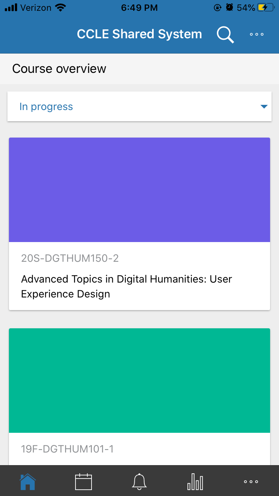

# Project Title 
## Emily DiPressi - Digital Humanities 150

Description or project overall 

### CCLE Mobile 
*The CCLE Mobile App is used in conjunction with the UCLA web CCLE (Common Collaboration and Learning Environment) page. It is the page where students access their course websites and materials such as a syllabus and readings. Assignments are submitted through here and grades are given here as well. It is a page where the instructor can give out information to the class as a whole.* 

#### Evaluation
*Overall: The CCLE Mobile App has a long way to go until it measures up to the CCLE webpage. There are many striking issues and the major one being that it is not properly synched to the students schedule. If all current classes are not on the app, there is no reason in the first place to use the app. In its current state the app is not used to its full capacity. There are many consistency errors that need to be fixed along with ease of usability.*

Heuristic & Description | CCLE Heuristic Evaluation | Improvement 
--------------------------|---------------------------|------------
**Visibility of system status:** The web/app gives the user feedback in a timely manner concerning the actions they are currently doing. | **Good:** Has loading clock visible. Bottom icon is highlighted to show you where you are. **Bad:** The app is not updated to show my current courses. I have a mixture of courses from Fall, Winter, and Spring (the current quarter). | **Improvement:** Make sure the app is fully linked or synched to be reflective of the CCLE online page and what the student is currently enrolled in.
**Match between system and real world:** Design and icons are based off of general knowledge. Things the user will easily recognize. | **Bad:** The graph at the bottom is not necessarily reflective of grades, not as easily recognizable. Within calendar there is a funnel, which has an unclear meaning - it means other classes. Three dots in calendar takes you to settings and that goes to a setting of notification time. | **Improvement:** The graph could be changed to an A+ symbol. The funnel could be a plus (indicating for more) or three dots. The notification time setting can be better, since there is only one option in settings, to have a different icon of a bell is better for notifications.
**User control and freedom:** User has options, such as undo or redo. | **Bad:** In notifications, there is a list of notifications that have been sent by instructor to the class through CCLE. I have multiple messages but there is no back button. Three dots at the top do not have a back button. | **Improvement:** Place a back button option at the top in addition to the three dot icon.
**Consistency and standards:** Design and usage is consistent across all pages of the web/app. | **Bad:** Some drop down menus are not the same style: check in circle; smaller, dark circle in larger one; square vs circle. In each course there are options at the top for Contents, Grades, and Competencies. Competencies is empty and the meaning of it is unknown. | **Improvement:** Have a uniform drop down menu style and select option. Have a description on pages where there is no information or titles can be ambiguous. 
**Error prevention:** Provide safety nets for user, such as confirming an action. | **Good:** There is a save button for when submitting assignments. | **No Improvements:** There seem to be enough precautions in place that will prevent the user from making any detrimental actions that cannot be undone.
**Recognition rather than recall:** Provide suggestions or context in actions. | **Bad:** Search courses, doesn’t search your courses but searches for other courses. | **Improvement:** Either describe what the search function is for or change the search function to be searching within your courses. 
**Flexibility and efficiency of use:** Make a page that is accessible to all, have basic functions at the forefront and more advanced options accessible through more steps. |**Good:** General settings and then more advanced, less used ones separate, such as synching. **Bad:** Sometimes there is extra navigation involved that does not require it, there is only one option in each navigation step. | **Improvement:** Depending on how many options in each setting step, reduce the amount of steps to get to the end option.
**Aesthetic and minimalist design:** Design is not cluttered and easily accessible. | **Bad:** The large colored bars for each class at the home page are not needed. They clutter the page and make it so you have to scroll more. | **Improvement:** Take away the colored blocks and just have separate, distinct boxes for each course.
**Help users recognize, diagnose, and recover from errors:** Have a non-concerning message about an error and give information on how to fix it of move forward. | **Bad:** Error notifications have to be manually put on, through a 4 step process. | **Improvement:** Have error notifications be set automatically. The user can manually turn them off if that is their choice.
**Help and documentation:** Have easily accessible and understandable help pages or pages with commonly asked questions. | **Bad:** Help takes you to an outside page, out of the app. The help seems to be more catered to administrators, rather than users. No search for help. No FAQ, common issues. No Trouble shooting. Help does not reflect the app or how it looks. | **Improvement:** Have a help that is centered for users within the app and one that reflects the app that is in use. An FAQ of troubleshooting option in the app would also be helpful. 

#### Severity Rating 
1. Top Priority
  * item
  * item 
2. Important to Fix
3. Small Inconvenience
